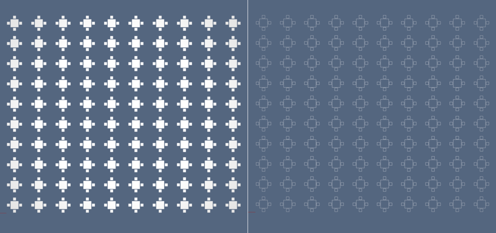
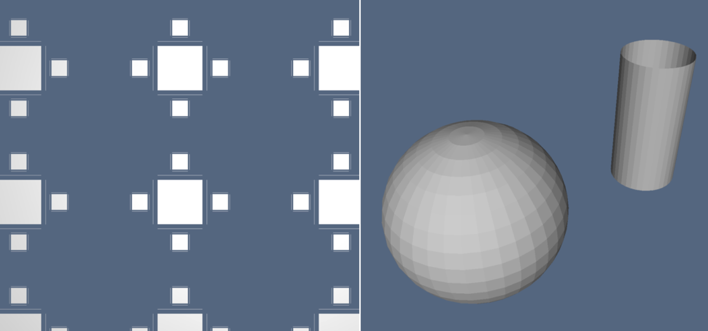

# Assemblies of cellular complexes


Hierarchical models of complex assemblies are generated by aggregation of cellular complexes, each one defined in a local coordinate system, and possibly
relocated by affine transformations of coordinates.  This operation may be repeated
hierarchically, with subassemblies defined by aggregation of simpler parts, and so
on, until to obtain a set of LAR models, which are not further decomposed.

Two main advantages can be found in a hierarchical modeling approach. Each component complex  and each assembly, at every hierarchical level, are defined independently from each other, using a local coordinate frame, suitably chosen to make its definition easier.
Furthermore, only one copy of each component is stored in memory, and may be instanced
in different locations and orientations how many times it is needed.


> **Figure 1:** Hierarchical assembly of a complex consisting of a single 2-cell (the square): (a) 2-skeleton; (b) 1-skeleton of the resulting complex.

## Hierarchical graphs

A [hierarchical model](#structure), defined inductively as an assembly of component parts,
is described by an *acyclic directed multigraph*, often called a *scene graph* or
*hierarchical structure* in computer graphics and modeling.  The main algorithm with
hierarchical assemblies is the *traversal* function, which transforms every component from
*local coordinates* to global coordinates, called *world coordinates*.

### Acyclic directed-multigraph

The standard definition of a *directed graph* $G$ states that it is a pair $(N,A)$, where
$N$ is a set of *nodes* and $A$ is a set of directed *arcs*, given as ordered pairs of
nodes.  Such a definition is not sufficient when more than one arc must be considered
between the same pair of nodes.

In this case the notion of *multigraph* is introduced.  A *directed multigraph* is a
triplet $G := (N,A,f)$ where $N$ and $A$ are sets of nodes and arcs, respectively, and $f:
A \to \mathbf{N}^{2}$ is a mapping from arcs to node pairs.  In other words, in a
multigraph, the same pair of nodes can be connected by multiple arcs.

Directed graphs or multigraphs are said to be *acyclic* when they do not contain cycles,
i.e. when no path starts and ends at the same vertex.  *Trees* are common examples of
acyclic graphs. A tree, where each non-leaf node is the root of a subtree, is the best
model of the concept of *hierarchy*. Nodes in a tree can be associated with their integer
*distance* from the root, defined by the number of edges on the unique path from the root
to the node.  A tree can be layered by *levels*, by putting in the same subset (level) all
the nodes with equal distance from the root.  

Acyclic graphs/multigraphs are also called *hierarchical graphs*, because they can be
associated to a tree, generated at run-time by visiting the graph with some standard
traversal algorithm, e.g. with a depth-first-search.  The ordered sequence of nodes
produced by the traversal is sometimes called a *linearized graph*.  Each node in this
sequence is suitably transformed from local coordinates to *world coordinates*, i.e. to
the coordinates of the root, by the traversal algorithm.


##  Hierarchical structures

Various kinds of hierarchical assemblies are used in standard graphical systems, such as
*GKS*, *PHIGS* and *VRML*, as well as in graphics libraries like *Open Inventor* and *Java
3D*.  The `type` of hierarchical structures adopted here is inspired, even in the name of
the function used for this purpose, by the one introduced by *PHIGS*, i.e. `Struct`.

The arcs of scene graphs are normally specified *implicitly* in real graphical systems.
For example, an arc is actually specified when a node is contained or referred within
another one. In particular, it is possible to specify a new container node together with
either the matrix or the parameters of the transformation to be associated with the the
arc that connects the new container to the current node.


##  Examples

A typical LAR geometrical model is a `Tuple` (triple or pair), where the first element is the *matrix of coordinates* of vertices, and the remaining arrays of array of integers provide the *vertex indices* of each *cell*. 

```julia  
julia> square = ([[0; 0] [0; 1] [1; 0] [1; 1]], [[1, 2, 3,
4]], [[1,2], [1,3], [2,4], [3,4]])
# output
([0 0 1 1; 0 1 0 1], Array{Int64,1}[[1, 2, 3, 4]], Array{Int64,1}[[1, 2], [1,
3], [2, 4], [3, 4]]) 
```
A *container* of geometrical objects is defined by applying the function `Struct` to
the array of contained objects.  The value returned from the application is a value of 
*Struct* type.  The coordinate system of this value is the one associated with the first object of the `Struct` parameters.  Also,
the resulting geometrical value is often associated with a variable name.

An affine $3\times 3$ transformation matrix, generated in homogeneous normalized coordinates by the function `t(-0.5,-0.5)`, can be *applied* to a LAR object `obj` both *explicitly*, by using the higher function `apply`$\to$`Matrix`$\to$`obj`, or *implicitly* by creating a `Struct` hierarchical object, as shown by the following examples:

```julia  
julia> table = apply( t(-0.5,-0.5) )( square )
# output
([-0.5 -0.5 0.5 0.5; -0.5 0.5 -0.5 0.5], Array{Int64,1}[[1, 2, 3, 4]],
Array{Int64,1}[[1, 2], [1, 3], [2, 4], [3, 4]])

julia> table = Struct([ t(-0.5,-0.5), square ])
# output
Struct(Any[[1.0 0.0 -0.5; 0.0 1.0 -0.5; 0.0 0.0 1.0], ([0 0 1 1; 0 1 0 1],
Array{Int64,1}[[1, 2, 3, 4]], Array{Int64,1}[[1, 2], [1, 3], [2, 4], [3, 4]])],
Array[[-0.5; -0.5], [0.5; 0.5]], "10234090646332247690", 2, "feature") 
```
The generation of container nodes may continue hierarchically by suitably applying `Struct`. Notice that each LAR object in a `Struct` container is transformed by each matrix before it *within the container*, going from right to left. The action of a transformation (tensor) extends to each object on its right within its own container. Whereas,  the action of a tensor does not extend outside its container, according to the semantics of *PHIGS* structures.

```julia 
chair = Struct([ t(0.75,0), s(0.35,0.35), table ])
```
The object `struct0` below contains a table and 4 chairs, `struct01` is a row of 10 suitably translated instances of `struct0`, and `struct02` is another assembly of suitably translated `struct01` instances. 

```julia 
struct0 = Struct([ t(2,1),table, repeat([r(pi/2), chair ], outer = 4)... ])
struct01 = Struct( repeat([ struct0, t(0,2.5) ], outer = 10) )
struct02 = Struct( repeat([ struct01, t(3,0) ], outer = 10) )
```

The function `evalStruct` generates an `Array` of LAR models, each one originally defined  in a *local coordinate* system, transforming all of them in the same *world coordinate*, equal to the ones of the *first* object in the `Struct` parameter sequence.

Conversely, the `struct2lar` function generates a *single* LAR model (cellular complex), whose components are here assigned respectively to variables `W` (coordinates of vertices), `FW` faces (2-cells), and `EW` edges (1-cells). Notice that the whole model is *embedded in 2D*, since the `W` array (coordinates by columns) has *two rows*

```julia 
scene = evalStruct(struct02)	# array of LAR models
W,FW,EW = struct2lar(struct02)	# single LAR model
```
Anyway, the `larView` function, which instances a `pyplasm` viewer, can be applied both to an array of models and to a single model. The examples below intend to show either the 2-cells or the 1-cells of the generated cellular complex, respectively.

```julia
using LARVIEW
larView(scene)
larView(W,EW)
```

A different example provides a `sphere`, and a `cylinder` instance suitably translated, within the same `Struct` container. Of course, we could define a hierarchical assembly of any size and deep, containing any number of `Struct` nodes.

```julia
assembly = Struct([sphere()(), t(3,0,-1), cylinder()()])
using LARVIEW
larView(struct2lar(assembly))
```


> **Figure 2:** (a) Enlargement of a portion of the exploded complex in Fig.1; (b) an assembly with two cuboidal 2-complexes (surfaces) embedded in 3D.

